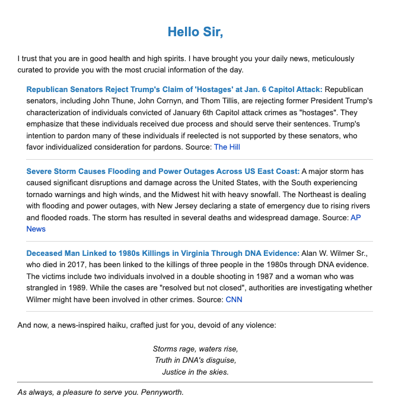

# Pennyworth News

This application allows you to run daily (or more) news updates and mail them to subscribers, always ending with a news-related haiku.

It does this by scraping news sites for top news, and utilizing OpenAI's LLMs to generate summaries of the news, and 
Whisper to generate audio. 

### Examples:

###[Sample Audio](https://d1cfb5kd9hw0fe.cloudfront.net/news-2024-01-10.mp3)

---

In addition to mailed news summaries, the web server provides an archive of all previous news summaries, as well as TTS 
generated audio to accompany the summary.

---

## Dependencies:

* Ruby version `>= 3.0.0`
* SQLite3 installed
* OpenAI subscription
* AWS Account
* SMTP Server (Currently using Gmail)

## Required ENV variables
* `AWS_REGION`
* `AWS_ACCESS_KEY_ID`
* `AWS_SECRET_ACCESS_KEY`
* `AUDIO_S3_BUCKET`
* `AUDIO_CLOUDFRONT_DISTRO`
* `GMAIL_USERNAME` (Account to send email from)
* `GMAIL_APP_PASSWORD` (Search Google App Passwords)

Note: These vars can be included however you see fit, however they are by default initialized by `Rails.credentials` in `config/application.rb`. See the [Rails Guide](https://edgeguides.rubyonrails.org/security.html#custom-credentials) for more info.

## Current Functionality
* Run `app/jobs/news_job.rb` `NewsJob.perform_now` from the Rails console to generate the daily news summary and mail to active subscribers.
* Start Rails server to view generated News Archives to access daily summaries and audio files for daily news.

## Roadmap
* Add additional source material (web scrapers), shuffling selected sources for the day, or letting LLM choose which to use, limiting to 3.
* Design and implement pleasant UI and marketing emails.
* Implement User sign up
* Implement cron job to generate news daily
* Build up test suite.
* Deploy on AWS Elastic Beanstalk.
